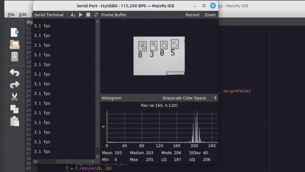
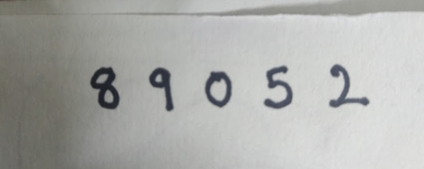

# Handwritten Digit Recognition using Kendryte K210 and Micropython





The Kendryte K210, used in the Maix Dock and other Sipeed boards, is an affordable and powerful alternative to other popular microcontrollers like the OpenMV boards. This repository showcases its capabilities in performing image segmentation and recognition tasks efficiently using MicroPython. For more information, please read my article: https://ashishware.com/2024/07/21/k210_digit_recognition/

### Prerequisites

1. Kendryte K210 board (example [Maix Dock M1](https://wiki.sipeed.com/soft/maixpy/en/develop_kit_board/maix_dock.html)) with camera and display(optional)
2. The board should be running latest MaixPy V1 firmware ([maixpy_v0.6.3_2](https://dl.sipeed.com/shareURL/MAIX/MaixPy/release/master) at the time of writing this readme)
3. [Pretrained model](https://github.com/sipeed/MaixPy-v1_scripts/blob/master/machine_vision/models/mnist.kmodel) on MNIST dataset.
4. The above mentioned firmware should be loaded to the board and the model should be burned to the `0x300000` location on the flash memory using [kflash-gui tool](https://github.com/sipeed/kflash_gui).
5. MaixPy IDE installed and connected to the board.
6. The sample image used in the experiment

   

### How to run

Copy the program from `code.py` and run it using the MaixPy IDE . Write down some digits on white paper with black marker (as shown above) and put it in front of the camera.  The board will segment the image, attempt to recognize each digit and should produce  output similar to the one shown below. If required adjust the `thresholds` for blob detections using the, `Threshold Editor` window in MaixPy IDE


### Known Issues

* If you are using Ubuntu and your board gets disconnected frequently, try uninstalling `brltty`

    ```
    sudo apt remove brltty
    ```

* I was unable to get picture from the board in the 'Frame Buffer' window of MaixPy IDE, so I  added  `print(img2.compressed_for_ide())` line in code.py and ran the code using `Serial Termial` in MaixPy IDE 
